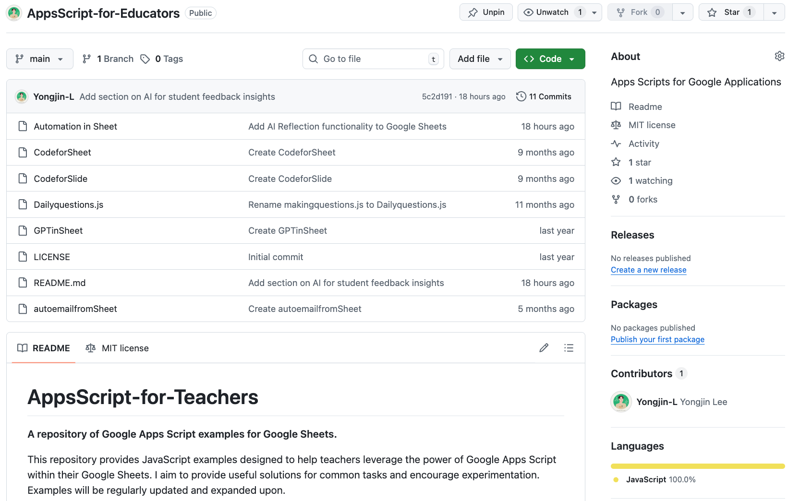
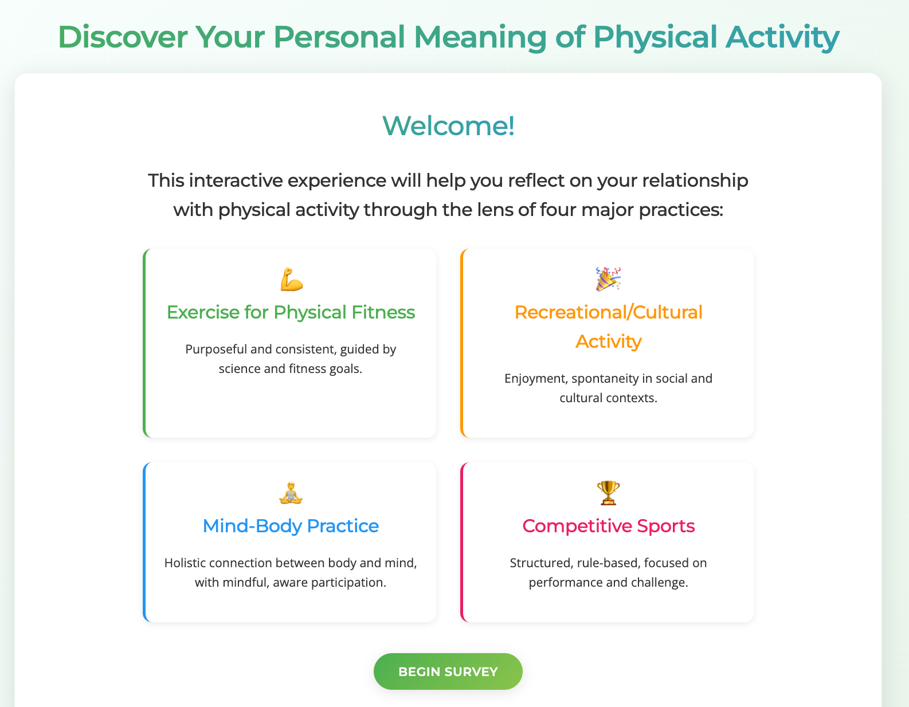

::: {.grid}

::: {.g-col-12 .g-col-md-6 .g-col-lg-4}
### AI-powered Review

{.img-fluid .mb-2}

An AI-powered academic review assistant for Physical Education research that reads your manuscript and key references to generate journal-style peer review feedback in minutes.

[Open app](https://paperreview.vercel.app/){.btn .btn-outline-primary}
:::

::: {.g-col-12 .g-col-md-6 .g-col-lg-4}
### AppsScript-for-Educators

{.img-fluid .mb-2}

A collection of Google Apps Script examples for Google Sheets that helps educators automate classroom workflows, send daily questions, and integrate AI (GPT) directly into their spreadsheets.

[View repository](https://github.com/Yongjin-L/AppsScript-for-Educators){.btn .btn-outline-primary}
:::

::: {.g-col-12 .g-col-md-6 .g-col-lg-4}
### Discover Your Personal Meaning of Physical Activity

{.img-fluid .mb-2}

A reflection web app that guides users through a short survey and AI-generated narrative to uncover their unique motivations and personal meaning behind physical activity.

[Open app](https://pameaning.onrender.com){.btn .btn-outline-primary}
:::

::: {.g-col-12 .g-col-md-6 .g-col-lg-4}
### CViz

{.img-fluid .mb-2}

An interactive CV visualizer that transforms static academic CVs into rich research narratives with themes, timelines, publication lists, and a citation-style network map.

[Open app](https://c-viz.vercel.app/){.btn .btn-outline-primary}
:::

::: {.g-col-12 .g-col-md-6 .g-col-lg-4}
### Pose Duration Tracker

{.img-fluid .mb-2}

An AI-powered pose tracking tool that uses Teachable Machine models to measure pose durations with real-time feedback, visualizations, session history, and CSV export for deeper analysis.

[Open app](https://mc25.onrender.com/){.btn .btn-outline-primary}
:::

:::